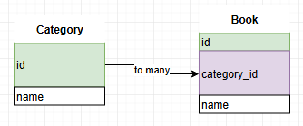

# XPDO


## Introduction

`XPDO` - Simple PDO wrapper and object mapper with prepared statements.

Supporting: MySQL, SQLite.

## Installation
PHP5.6 , PHP7.0+

`composer require aphp/xpdo`

## Features

* MYSQL, SQLite support.
* Prepared statement syntax for queries.
* Params values binding.
* Syntax like PDO.
* Model like ORM.
* Relations support: one-to-one, one-to-many, many-to-many.
* JSON fields support.
* Date fields support.
* PSR logger support for the query debugging.

## Hello world
This is the object configuration of sample code at the down.

* Class name `user` is equal to database table name `user`.
* `keyField` is default (=id).
* `keyFieldAutoIncrement` is default (=true).
* `jsonFields`, `dateFields`, is empty by default. (=[])
* `relations` is empty by default (=[]).

Sample code:

```php
<?php
require 'vendor/autoload.php';

use aphp\XPDO\Database;
use aphp\XPDO\Model;

class user extends Model {
	//  uncomment this to get more options
	/*
	static function tableName() {
		return 'user'; // table custom name
	}
	static function keyField() {
		return 'id'; // keyField custom name
	}
	static function jsonFields() {
		return [];
	}
	static function dateFields() {
		return [];
	}
	static function relations() {
		return [];
	}
	static function keyFieldAutoIncrement() {
		return true; // false if auto increment is not used
	}
	*/
}

$db = Database::getInstance();
$db->SQLiteInit('sampleBase.sqlite');

$user = user::newModel();

$user->name = 'user ' . time();
$user->save(); // insert

// read user from database
$user2 = user::loadWithId( $user->id );
print_r($user2);
```
Result
```
user Object
(
    [id] => 2
    [name] => user 1552874005
    [email] =>
    [gender] =>
    [age] =>
    [binary] =>
    [_model_isLoadedWithDB] => 1
    [_model_isDeleted:protected] =>
)
```
## Documentation
<details><summary><b>&#x1F535; Database</b></summary>
<p>

### Initialization
```php
use aphp\XPDO\Database;

$db = Database::getInstance();
$db->SQLiteInit('sampleBase-temp.sqlite');
// --
$db->MySQLInit($user, $password, $database, 'localhost');
```
### Logger
```php
use aphp\logger\FileLogger;

$logger = FileLogger::getInstance();
$logger->configure('logs/log');
$logger->startLog();

$db->setLogger( $logger );
```
</p>
</details>
<details><summary><b>&#x1F535; Statement</b></summary>
<p>

### Prepare
```php
use aphp\XPDO\Database;

$db = Database::getInstance();
$statement1 = $db->prepare("SELECT `name` FROM user WHERE id = ?");
$statement2 = $db->prepare("SELECT `name` FROM user WHERE id = :idvalue");
```
### Bind values
```php
$statement1->bindValues( [ 1 ] );

$statement2->bindNamedValue( 'idvalue', 1 );
$statement2->bindNamedValues( [ 'idvalue' => 1 ] );
```
### Execute
```php
$statement1->execute(); // for UPDATE or INSERT queries
```
### Prepare-Bind-Execute
```php
use aphp\XPDO\Database;

$db = Database::getInstance();
$db->prepare("INSERT INTO user ( `name`, `email`, `gender`, `age` ) VALUES ( :name, 'email2', 2, 1.5 )")
   ->bindNamedValue( 'name', 'Donella Nelson' )
   ->execute();
```
### Fetch all - select all rows
```php
$result = $db->prepare("SELECT * FROM user")->fetchAll();
print_r($result); // array[row][field]
```
### Fetch line - select first row
```php
$result = $db->prepare("SELECT * FROM user")->fetchLine();
print_r($result); // array[field]
```
### Fetch One - select first value in first row
```php
$result = $db->prepare("SELECT * FROM user")->fetchOne();
print_r($result); // value
```
### Statement-Empty
If fetch results is empty, that can be checked by `IF` operator<br>
Empty value is configured by `ModelConfig::$fetchAll_nullValue = [];`<br>
```php
$result = $db->prepare("SELECT * FROM user WHERE id = 2304")->fetchAll();
if (count($result) != 0) {
	print_r($result); // array[row][field]
} else {
	var_dump($result); // []
}
```
### Empty fetch line
```php
if ($result = $db->prepare("SELECT * FROM user WHERE id = 2304")->fetchLine()) {
	print_r($result); // array[field]
} else {
	var_dump($result); // NULL
}
```
### Empty fetch one
```php
if ($result = $db->prepare("SELECT * FROM user WHERE id = 2304")->fetchOne()) {
	print_r($result); // value
} else {
	var_dump($result); // NULL
}
```
### Statement-Blob
https://secure.php.net/manual/en/pdo.lobs.php

Bind blob param from file
```php
$statement = $db->prepare("UPDATE user SET `binary` = :blob WHERE id = :id");
$statement->bindNamedBlobAsFilename('blob', 'pathToFile/filename.jpg');
$statement->bindNamedValue('id', 2);
$statement->execute();
```
Bind blob param from value
```php
$fp = fopen($filename, 'rb'); // read file
if ($fp === false) {
	throw new Exception($filename);
}
$statement = $db->prepare("UPDATE user SET `binary` = :blob WHERE id = :id");
$statement->bindNamedBlob('blob', $fp);
$statement->bindNamedValue('id', 2);
$statement->execute();
```
### Fetch object
```php
class User_object {
	public $id;
	public $name;
	public $email;
	public $param1_v;
	public $param2_v;

	function __construct($param1, $param2) {
		$this->param1_v = $param1;
		$this->param2_v = $param2;
	}
}

$db = Database::getInstance();
$statement = $db->prepare("SELECT `id`, `name`, `email` FROM user WHERE id = 1");
$obj = $statement->fetchObject(User_object::class, [ 'p1', 'p2' ]);

print_r($obj);
```
```
User_object Object
(
    [id] => 1
    [name] => user1
    [email] => email1
    [param1_v] => p1
    [param2_v] => p2
)
```
### Fetch All objects
```php
$statement = $db->prepare("SELECT `id`, `name`, `email` FROM user");
$objects = $statement->fetchAllObjects(User_object::class, [ 'p1', 'p2' ]);

print_r($objects);
// $objects = array [objects]
```
</p>
</details>
<details><summary><b>&#x1F535; Statement - cache</b></summary>
<p>
Database supported the cached results for statements.<br>
To enable this feature use this code:

```php
$db->setFetchCacheEnabled(true);
```

All next `SELECT` queries are cached, and not execute twice.
This feature is useful with relation models, for increase the performance of virtual fields.

```php
$statement = $db->prepare('SELECT * FROM user WHERE id = 1');
$statement->__objectID = 'statementID';
$user = $statement->fetchLine();
//
$statement2 = $db->prepare('SELECT * FROM user WHERE id = 1');
$user = $statement2->fetchLine(); // load from cache

//
var_dump($statement == $statement2); // true, cache enabled, statement instance not create twice
var_dump($statement2->__objectID == 'statementID');  // true
var_dump($statement2->_cached == true);  // true, cache feature is enabled
```

If `UPDATE` , `INSERT` or any non `SELECT` query executed, then cache will reset.<br>
For manual reset use:
```php
$db->resetFetchCache();
```
For disable caching use:
```php
$db->setFetchCacheEnabled(false);
```
</p>
</details>
<details><summary><b>&#x1F535; Model</b></summary>
<p>

### new Model
```php
use aphp\XPDO\Database;
use aphp\XPDO\Model;

class user extends Model {

}

$user = user::newModel();
```
### new Model - visible fields
```php
class user extends Model {
	public $id;
	public $name;
	public $email;
	public $gender;
	public $age;
	public $binary;
}

$user = user::newModel();
```
### new Model - key field
```php
class user extends Model {
	static function keyField() {
		return 'id';
	}
}
$user = user::newModel();
```
### new Model - table name
```php
class user extends Model {
	static function tableName() {
		return 'user';
	}
}
$user = user::newModel();
```
### new Model - key field auto increment
```php
class user extends Model {
	static function keyFieldAutoIncrement() {
		return true;
	}
}
$user = user::newModel();
```
### Model - Save
The insert query performs automatically.

```php
use aphp\XPDO\Database;
use aphp\XPDO\Model;

class user extends Model {

}

$user = user::newModel();
$user->name = 'Loguyyo Vielyra';
$user->email = 'Vielyra@mail.com';

$user->save();
```
The update query performs automatically.
```php
$user->email = 'newValue@mail.com';
$user->save();
// for optimization use the fields param
$user->save( ['email'] );
```
### Model - Load
Load with id
```php
$user = user::loadWithId(1);
```
Load with field
```php
$user = user::loadWithField('name', 'userName');
```
Load with field and columns 'name' , 'email' (optimized)
```php
$user = user::loadWithField('name', 'userName', ['name', 'email']);
```
### Model - Select
Using select queries for loading models
```php
$statement = $db->prepare('SELECT * FROM user');
$object = user::loadWithStatement($statement);
print_r($object);
```
Load all
```php
$statement = $db->prepare('SELECT * FROM user');
$objects = user::loadAllWithStatement($statement);
print_r($objects);
```
### Model - Where Query
Load with where query
```php
$object = user::loadWithWhereQuery('id = ?', [ 0 ]);
print_r($object); // user
```
Load all with where query
```php
$objects = user::loadAllWithWhereQuery('id > ?', [ 0 ]);
print_r($objects); // [ user ]
```
Load all : `SELECT * FROM user` equivalent
```php
$objects = user::loadAll();
print_r($objects); // [ user ]
```
### Model - Delete
Delete model from database
```php
$user = user::loadWithId(1);
$user->delete();
```
Delete model from database, optimizing
```php
$user = user::loadWithId(1, [ user::keyField() ]);
$user->delete();
```
</p>
</details>
<details><summary><b>&#x1F535; JSON</b></summary>
<p>
JSON bind detection is enabled by default.

```php
Utils::$_jsonBindDetection = true;
```
Bind json field value (INSERT, UPDATE).<br>
If value is ARRAY then it's detecting as JSON type.
```php
$json = ['sampleJson' => 'jsonValue'];
// api with bindNamedValue
$statement->bindNamedValue('email', $json);

// api with bindValues
$statement->bindValues([ $json, 'otherFieldValue', 'otherFieldValue' ]);
```
In database this values stored as TEXT type, not JSON.<br>

`SELECT` queries need to call `$statement->setJSONColumns` before fetching.
```php
$statement->setJSONColumns([ 'email' ]);
$data = $statement->fetchLine();
print_r($data['email']); // will see JSON ARRAY
```
Models using `jsonFields` to set JSON fields
```php
class user extends Model {
	static function jsonFields() {
		return [ 'email' ];
	}
}
```
</p>
</details>
<details><summary><b>&#x1F535; DateTime</b></summary>
<p>
DateTime class is used to store and edit the date time.

```php
class DateTime
{
	public function isTimeText($text);
	public function isDateText($text);
	public function isDateTimeText($text);

	public function setText($text);
	public function getText();

	// dt = dateTime, d = date, t = time
	public function setNow($dt = null);
	public function setTimestamp(/* int */ $timestamp, $dt = null);

	public function getDate();
	public function getTime();
	public function getDT();

	public function getPHPDateTime(); // \DateTime
	public function getTimestamp(); // int
}
```
Bind date field value (INSERT, UPDATE).
```php
use aphp\XPDO\DateTime;
// example of dateTime, date and time formats
$dateTime = new DateTime('2019-11-22 14:55:59');
$date = new DateTime('2019-11-22');
$time = new DateTime('14:55:59');
// api with bindNamedValue
$statement->bindNamedValue('dateTime', $dateTime);
// api with bindValues
$statement->bindValues([ $dateTime, 'otherFieldValue', 'otherFieldValue' ]);
```
`SELECT` queries need to call `$statement->setDateColumns` before fetching.
```php
$statement->setDateColumns([ 'v_date' ]);
$data = $statement->fetchLine();
print_r($data['v_date']); // will see aphp\XPDO\DateTime
```
Models using `dateFields` to set DateTime fields
```php
class timeTable extends Model {
	static function dateFields() {
		return ['v_dateTime', 'v_date', 'v_time'];
	}
}
```
See [example05.php](example/example05.php) for more practice.
</p>
</details>
<details><summary><b>&#x1F535; Multiple Databases</b></summary>
<p>
By the default used 1 instance of database.<br>
To create `multiple` instances use sample code:

```php
class DBStatic {
	static $db1;
	static $db2;
}
DBStatic::$db1 = = new Database;
DBStatic::$db1->SQLiteInit( $filename1 );

DBStatic::$db2 = = new Database;
DBStatic::$db2->SQLiteInit( $filename2 );

```
Models needs to override `database` method
```php
class User_db01 extends Model {
	static function database() {
		return DBStatic::$db1
	}
}

class User_db02 extends Model {
	static function database() {
		return DBStatic::$db2;
	}
}
```
</p>
</details>
<details><summary><b>&#x1F535; Relation Class</b></summary>
<p>

```php
class Relation {
	public function toManyAdd($name, Model $relationModel);
	public function toManyAddAll($name, $relationModels); // name, [ Model ]
	public function toManyRemove($name, Model $relationModel);
	public function toManyRemoveAll($name);
	public function reset(); // reset property cache

	public function setFields(/*Array*/ $fields); // -> $this
	public function orderBy($field, $asc = true); // -> $this
}
```
This class is created automatically while runtime calling the relations.
```php
// Read
  $object = $model->relation()->%nameToOne%;
  $objects = $model->relation()->%nameToMany%;
  $objects = $model->relation()->%nameManyToMany%;
// Write
  $model->relation()->%nameToOne% = $object;
// toMany write
  $model->relation()->toManyAdd('%nameToMany%', $object);
  $model->relation()->toManyAdd('%nameManyToMany%', $object);

  $model->relation()->toManyAddAll('%nameToMany%', $objects);
  $model->relation()->toManyAddAll('%nameManyToMany%', $objects);

  $model->relation()->toManyRemove('%nameToMany%', $object);
  $model->relation()->toManyRemove('%nameManyToMany%', $object);

  $model->relation()->toManyRemoveAll('%nameToMany%');
  $model->relation()->toManyRemoveAll('%nameManyToMany%');
```
Setting load fields or order for relations.
```php
// Read , set load fields
  $object = $model->relation()->setFields(['field1', 'field2'])->%nameToOne%;
  $objects = $model->relation()->setFields(['field1', 'field2'])->%nameToMany%;
// Read , set order
  $objects = $model->relation()->orderBy('field1')->%nameToMany%;
// Read , set order multiple fields
  $objects = $model->relation()->
    orderBy('field1')->orderBy('field2')->
    %nameToMany%;
// Read , set order , set fields
  $objects = $model->relation()->
   orderBy('field1')->setFields(['field1', 'field2'])->
   %nameToMany%;
```
</p>
</details>
<details><summary><b>&#x1F535; Relations</b></summary>
<p>

### Configure

Relations are configured by static method `relations()`.
```
// to one
this->%field% ** %class%->%id%
// to many
this->%id% *-** %class%->%field%
```
Many to many used 2 rules.
```
this->%id% *-** %MiddleClass%->%field1%,
%MiddleClass%->%field2% ** %class%->%id%
```
Class namespaces by default is autodetected.
```php
// autodetecting
ModelConfig::modelClass_relation_namespace = 'auto';
// set the namespace models
ModelConfig::modelClass_relation_namespace = 'RT\Test\Sample';
```
Full namespace is allowed to set in rules.
```
this->%field% ** RT\Test\Sample\%class%->%id%
```

### Syntax to-one


```php
class Category extends Model { }

class Book extends Model {
  static function relations() {
    return [
      'category' => 'this->category_id ** Category->id'
    ];
  }
}
```
Read
```php
$book = Book::loadWithField('name', 'Role of Religion');
$category = $book->relation()->category; // Category OR null
```
Write
```php
$book = Book::loadWithField('name', 'Role of Religion');
$category = Category::loadWithField('name', 'capitalism');
$book->relation()->category = $category;
```
Null
```php
$book->relation()->category = null;
```
### Syntax_to-many



```php
class Category extends Model {
  static function relations() {
    return [
      'books' => 'this->id *-** Book->category_id'
    ];
  }
}

class Book extends Model { }
```
Read
```php
$category = Category::loadWithField('name', 'capitalism');
$books = $category->relation()->books; // [ Book ] OR [ ]
```
Write
```php
$category = Category::loadWithField('name', 'capitalism');
$book = Book::loadWithField('name', 'Motherhood');
$category->relation()->toManyAdd('books', $book);
```
Null
```php
$category = Category::loadWithField('name', 'capitalism');
// self book
$book1 = $books = $category->relation()->books[0];
$category->relation()->toManyRemove('books', $book1);
// book from database
$book2 = Book::loadWithField('name', 'Motherhood');
$category->relation()->toManyRemove('books', $book2);
// all
$category->relation()->toManyRemoveAll('books');
```
### Syntax many to many


```php
class Book extends Model {
  static function relations() {
    return [
      'tags' => [
        'this->id *-** TagBook->book_id',
        'TagBook->tag_id ** Tag->id'
      ]
    ];
  }
}
class Tag extends Model {
  static function relations() {
    return [
      'books' => [
        'this->id *-** TagBook->tag_id',
        'TagBook->book_id ** Book->id'
      ]
    ];
  }
}
class TagBook extends Model {
  static function keyField() {
    return null; // optional, need testing for cases
  }
}
```
Api for `many-to-many` relations is same as `to-many`.

**[Syntax_to-many](###Syntax_to-many)**

Read (like toMany)
```php
$book = Book::loadWithField('name', 'Motherhood');
$tags = $book->relation()->tags; // [ Tag ] OR [ ]
```
</p>
</details>
<details><summary><b>&#x1F535; Relation magic methods</b></summary>
<p>

Relation allows to use magic methods for model.<br>
The magic methods are not using `$model->relation()` syntax for shorter code.<br>
Syntax:
```php
$relationModel = $model->%relationName%;

$model->%relationName% = $relationModel;

$model->toManyAdd('%relationName%', $relationModel);
$model->toManyAddAll('%relationName%', $relationModels);
$model->toManyRemove('%relationName%', $relationModel);
$model->toManyRemoveAll('%relationName%');

$relationModels = $model->relation_orderBy('%field%', true|false)->%relationName%;
```
</p>
</details>
<details><summary><b>&#x1F535; Relation recommendations</b></summary>
<p>

* Write relation action performs <b>saving</b> model <b>immediately</b>.
* Use Database::transactionBegin() to optimize the relations writing.
* Use logger for debug, and see SQL queries.
</p>
</details>

## Test running

* install __phpunit, composer, php__ if not installed
* run __composer install__ at package dir
* run __tests/startTest-sqlite.bat__
* run __tests/startTest-mysql.bat__

On linux use *.sh files like *.bat files

<details><summary><b>&#x1F535; Useful links</b></summary>
<p>

* CMD windows
	* [WindowsPathEditor](https://rix0rrr.github.io/WindowsPathEditor/)
	* [conemu](https://conemu.github.io/)
* PHP in CMD
	* [windows.php.net](https://windows.php.net/)
	* [xampp](https://www.apachefriends.org/ru/index.html)
	* [phpunit 5](https://phpunit.de/getting-started/phpunit-5.html)
	* [phpunit in bat](https://stackoverflow.com/questions/24861233/phpunit-setup-in-batch-file)
	* [composer in bat](http://leedavis81.github.io/global-installation-of-composer-on-windows/)
* Git client
	* [git](https://gitforwindows.org/)
	* [smartgit](https://www.syntevo.com/smartgit/)

</p>
</details>

## More features
For more features:
* read source code and examples
* practice with `XPDO` in real code

